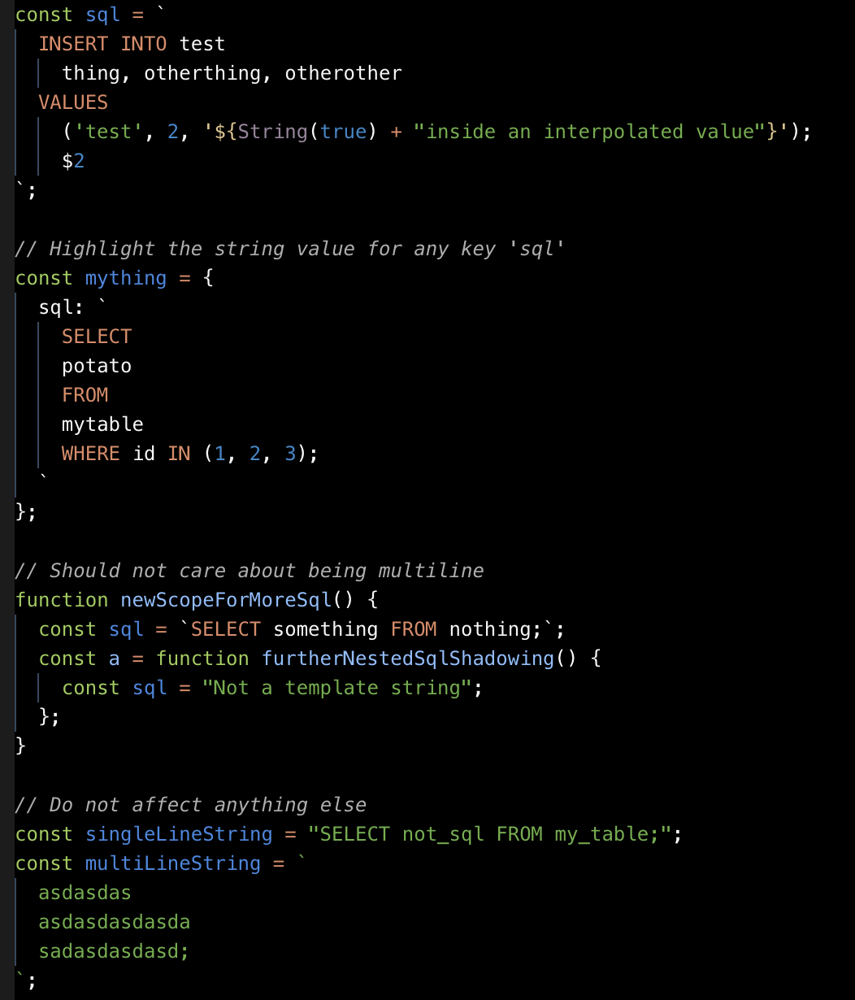

### Description

Highlights your sql code inside js strings under some conditions



Forked from https://github.com/mydesireiscoma/es6-string-html but significantly changed to support the following behavior:

- All consideration for html removed. This extension is just for highlighting sql in js
- no flags or comments are required.
- Any variable `sql` assigned a template string value should apply sql syntax highlighting to that value

```js
const sql = `
  INSERT INTO test
    thing, otherthing, otherother
  VALUES
    ('test', 2, '${String(true) + "inside an interpolated value"}');
    $2
`;
```

- Any object key `sql` assigned a template string value should apply sql syntax highlighting to that value

```js
const mything = {
  sql: `
    SELECT
    potato
    FROM
    mytable
    WHERE id IN (1, 2, 3);
  `
};
```

### To install:

I haven't gotten around to setting up a marketplace publishing account so clone this repo or at least download the `.vsix` file then run:

```sh
code --install-extension js-sql-highlight-1.0.0.vsix
```

### Would be nice to have:

- Settings-defined var/key names on which to highlight
